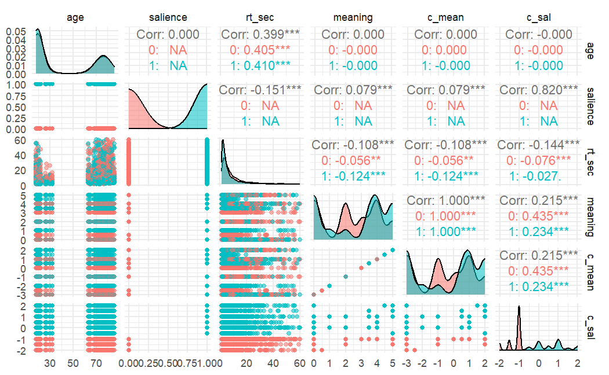

## Introduction

This report analyzes a dataset measuring reaction time (RT) and salience levels using multilevel modeling (MLM). With this, we wish to address the following two questions: 

1. What is the association with painting salience and reaction time?
2. Does the association between painting salience and reaction time differ based on old age?

This data originates from Hoffman et al. (2007). 

## Preprocessing Pipeline 

We chose a simple mutation of the `salience` variable to turn this into a binary classification task. For `salience` values greater than $2.5$, we assigned the value $1$ (high salience); otherwise, we snapped the values down to $0$ (low salience). 

To visualize the more salient features in our dataset, we expressed $6$ of them in a scatterplot matrix backed by the `GGally` package. This helped us explore patterns between numeric features, with additional coloring based on which `salience` type values leaned to. Specifically, features observed included: 

- `age`
- `salience` 
- `rt_sec`
- `meaning`
- `c_mean`
- `c_sal`

In the below image, we can assess that reaction time (`rt_sec`) decreases with higher salience.

## Model 1: Random Intercepts Model 

The initial model included random intercepts for individuals (id) to account for between-person variation. Here is how the model is specified: 

$$ RT_{ij} = \beta_0 + u_{0j} + \epsilon_{ij} \text{,  } u_{0j} \sim N(0, \sigma^2_u)$$
Our fixed effect was the estimated average reaction time across all individuals, which returned a value of $7.4022$ seconds. Additionally, our Inter-class Correlation Coefficient showed that $18.72%$ of total variation in reaction time score is due to the difference in person. Below are the step-by-step calculations: 

$$ICC = \frac{\sigma^2_u}{\sigma^2_u+\sigma^2}=\frac{12.31}{12.31+53.44}=0.1872.$$

We can interpret this by saying that 18.72% of the total variation in reaction time is attributable to differences between individuals, justifying the use of a multilevel model.

## Model 2: Random Slopes and Intercept Model 

A random slopes and intercepts model was fitted to examine the effect of salience on reaction time while allowing for individual variability in slopes. Here's how our model was specified: 

$$ RT_{ij} = \beta_0 + \beta_1 \cdot \text{salience}_{ij}+u_{0j} + u_{1j} \cdot \text{salience}_{ij}+\epsilon_{ij}$$
This time, the observed effect of salience was $-1.0998$, indicating that for salient images (`salience` $= 1$), reaction time decreases on average by $1.10$ seconds. This is expected; the more salient an image (e.g., clearer or more obvious), the faster participants react.

## Model 3: Random Slopes with Age Interaction

A third model is needed to test our second research question, which aims to find the association between salience, given age. Here is the specification: 

$$
RT_{ij} = \beta_0 + \beta_1 \cdot \text{sal}_{ij} + \beta_2 \cdot \text{old}_{ij} + \beta_3 \cdot (\text{old} \cdot \text{sal}) +u_{0j} + u_{1j} \cdot \text{sal}_{ij}+\epsilon_{ij}
$$

This time, we had a salience effect of $-1.098$. The interaction of `oldage` and `salience` was not strongly significant, suggesting age may not substantially alter the effect of salience.

## Summary

Summary of Models:

- Random intercepts only: Basic structure showing individual variability.
- Random slopes: Demonstrated the significant negative effect of salience on reaction time.
- Interaction model: Explored but did not yield significant improvements.

Future research could include additional predictors or focus on more granular age effects.

